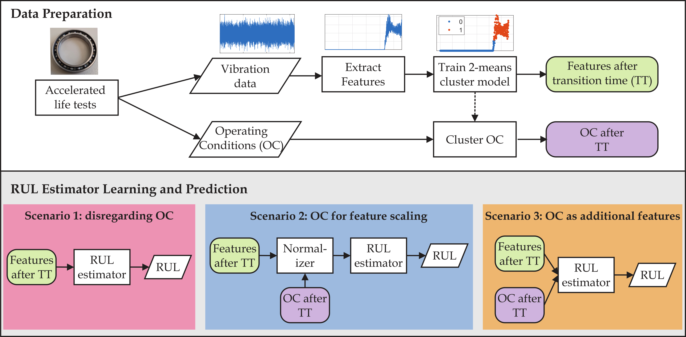

# Remaining Useful Lifetime Estimation of Bearings Operating under Time-Varying Conditions

This repository contains the code for the paper [Remaining Useful Lifetime Estimation of Bearings Operating under Time-Varying Conditions](https://papers.phmsociety.org/index.php/phme/article/view/4101),
written by Alireza Javanmardi, Osarenren K. Aimiyekagbon,  Amelie Bender, James K. Kimotho, Walter Sextro, and Eyke Hüllermeier.
This paper appears in the $8^\text{th}$ European Conference of the PHM Society, 2024.

This paper addresses the estimation of the remaining useful lifetime (RUL) of bearings under time-varying operating conditions. The original dataset, which includes raw vibration data and operating conditions, is available on [Zenodo](https://doi.org/10.5281/zenodo.10805042). In the [data folder](./data/LDM/) of this repository, you can find the extracted features along with the operating condition information.

The entire pipeline, from data preprocessing to various RUL estimation scenarios, is illustrated in the following flow chart. 


## Setup
1. Clone the repository
2. Create a new virtual environment and install the requirements:
```shell
 pip install -r requirements.txt
```
3. Activate the virtual environment and run:
  ```shell
 python main.py B17 20 0 op_ignore
 ```
This line of code sets aside the 17th bearing for testing and uses the remaining bearings for training. It also sets the bucket size to 20, initializes the random seed to 0, and uses op_ignore as the RUL estimation scenario. 

## Citation

If you use this code, please cite our paper:

```
@inproceedings{javanmardi2024bearing,
      title = {Remaining Useful Lifetime Estimation of Bearings Operating under Time-Varying Conditions}, 
      author = {Javanmardi, Alireza and Aimiyekagbon, Osarenren Kennedy and Bender, Amelie and Kimotho, James Kuria and Sextro, Walter and H\"{u}llermeier, Eyke},
      booktitle={Proceedings of the European Conference Of The PHM Society},
      year={2024}
}

```